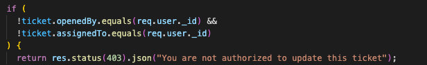

# Fix Hub

## Description

Fix Hub is my third development project — and my first using a separate front end and back end. It’s an IT incident management solution where users, depending on their role, can create, update, and delete IT tickets.

Having worked extensively with ServiceNow as a Business Analyst, I’m familiar not only with its functionality, but also with how much data is collected to give users meaningful insights into their incidents. I was eager to explore how to build this kind of functionality myself, especially with a focus on adding visual charts and presenting data in more interactive, informative ways.

## Links

[Back End Repo](https://github.com/jamiekaye9/fix-hub-back-end)
[Deployed Site](https://fix-hub.netlify.app/)

## Getting Started/Code Installation

1. Create a local 'Fix-Hub' folder.
2. Inside that folder, clone both the front-end and back-end Github repositorties.
  - git clone https://github.com/jamiekaye9/fix-hub-front-end
  - git clone https://github.com/jamiekaye9/fix-hub-back-end
3. Navigate inside of the fix-hub-front-end folder.
4. Create a .env file containing:
  - VITE_BACK_END_SERVER_URL=http://localhost:3000
5. Run npm install in the terminal.
6. Run npm run dev in the terminal.
7. In a seperate terminal window, navigate into the fix-hub-back-end folder.
8. Create a .env file containing:
  - MONGODB_URI= (your MongoDB token)
  - JWT_SECRET= (a secret code of your choosing)
  - FRONTEND_URL=http://localhost:5173
9. Run npm install in your terminal.
10. Run npm run dev in your terminal.

## Timeframe & Working Team

This was a solo project, built in the timeframe of 1 week.

## Technologies Used

JavaScript, JSX, React, Express, MongoDB, JWT and Bcrypt.

## Brief

- Build a full stack application with an Express and Node back-end and a React front=end.
- Use MongoDB as your database management system.
- Implement JWT token-based authentication to sign up, sign in and sign out users.
- Guest users should not be able to create, update or delete data.
- The project must have at least two data entities in addition to the User model. At least one entity must have a relationship with the User model.
- The project must have full CRUD functionality on both the back-end and front-end.
- The app much utilise CSS flexbox.

## Planning

To plan this project, I created User Stories, Sretch User Stories, an ERD, Wireframes and a RESTful Routing table. This can all be found in the Trello Link below.

[Planning Documents](https://trello.com/invite/b/67f91687bcd79b3137051789/ATTI296a2474f2f8b7b7e2c65976c1a2dd7571F6699D/fix-hub)

## Build/Code Process

I started this project by building JWT middleware, creating a verifyToken function. This function checks the authorisation header in the incoming request and extracts the token. The token is then verified using JWT. If the token is valid, the decoded payload is added to the req object. I then included a next function to move to the next middleware or route handler. This was initially a complex concept to understand, but I soon realised how beneficial JWTs are for securely passing user data with each request, avoiding the need to query the database every time.

I then moved on to building my models. When building the User schema, I included a 'role' field, which has two options of either 'service desk' or 'requestor'. Although this was not in my initial plan, I realised how one additional field opens up the opportunity for different levels of permissions and access.

Moving onto the ticket creation route, I had the plan to assign new tickets automatically to the least busy service desk user. To do this, I used 'reduce' to efficiently find the object with the lowest ticket count, helping identify the least busy user without needing to sort an entire array.

I was keen to include permissions throughout my application to help protect data and actions. I started by adding permission checks to the edit ticket functionality in my tickets controller. My goal was to ensure that only the user who created the ticket or the user assigned to it could make edits.

To achieve this, I added an if statement that checks whether the openedBy or assignedTo field matches req.user. If neither matches, the system returns a message and blocks the action.

Moving onto my front-end, I was not satisfied by how ticket fields like 'status' and 'priority' retained their camel casing in the UI. I created two helper functions to improve the readability of text in my application. 

The capitalise function takes a word and returns it with the first letter converted to uppercase. It uses optional chaining to safely handle cases where the word might be null or undefined.

The splitCamelCase function takes a camelCase string and inserts spaces before each uppercase letter, making it easier to display field names or labels to users. This was especially useful for formatting property names like assignedToManager into a more readable form like assigned To Manager.

Using React gave me the opportunity to implement visual charts through libraries. My instructor advised me to use 'Recharts', which worked really well to meet my requirements. When building my barchart, which shows 'open' and 'in progress' tickets by priority, I set the size and spacing of the chart so it fits nicely within the layout of the page. Each bar has its own colour, which I applied by looping through my data and assigning a different fill to each one.

I also added a legend that matches the colours of the bars, helping users see what each one represents. To make the chart feel more polished, I added animations so the bars smoothly appear when the chart loads. This helped create a clearer and more engaging way to present the data.

## Challenges

## Key Learnings/Takeaways

## Future Improvements

### Next Steps
I would like to enhance this application, so that a User can create or join a company that holds company exclusive tickets. This would allow individual companies to use the app. I would also like to create a separate reporting page that contains reports specific to the user's activity in the app.